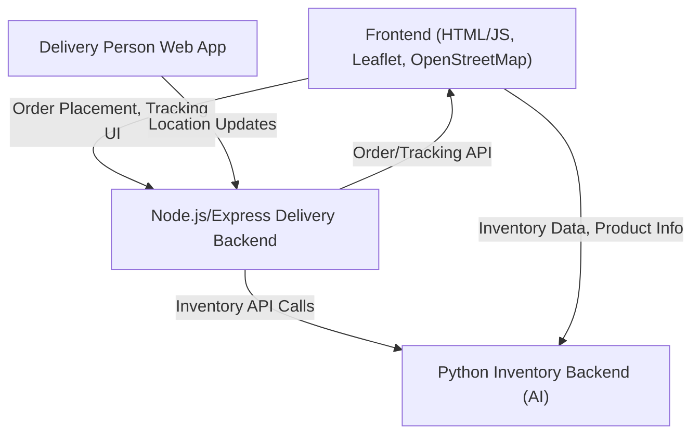

# Grocery E-Commerce Platform with Real-Time Delivery & AI Inventory Management

A modern, full-stack grocery e-commerce platform featuring:
- Real-time delivery tracking with live map updates
- Map-based address selection for customers
- Live delivery person tracking (like Zomato/Swiggy)
- AI-powered inventory management and demand forecasting
- Seamless integration between frontend, Node.js/Express backend, and Python AI backend

---

## 🚀 Features

### 🗺️ Real-Time Delivery Tracking
- **Live Map Updates:** Customers can track their order and delivery person in real time on a map (OpenStreetMap + Leaflet)
- **Map-Based Address Selection:** Customers select delivery address via interactive map
- **Route & ETA Display:** See delivery route and estimated time of arrival
- **Delivery Person App:** Delivery personnel update their live location via a simple web interface

### 🛒 E-Commerce & Product Management
- **Product Catalog:** Browse, search, and view detailed product info
- **Order Placement:** Place orders with address selection and receive order ID for tracking
- **Offers, Coupons, Reviews:** Modern e-commerce features

### 🤖 AI-Powered Inventory Management
- **Demand Forecasting:** Python backend (LSTM/ML) predicts inventory needs
- **Stock Optimization:** Avoids overstock/stockouts, reduces costs, and maximizes sales
- **Historical Data Analysis:** Uses sales, inventory, and pricing data for accurate predictions

---

## 🏗️ System Architecture



- **Frontend:** Static HTML/JS, Leaflet for maps, connects to both backends via REST APIs
- **Node.js/Express Backend:** Handles orders, delivery tracking, and API endpoints
- **Python Inventory Backend:** AI/ML for inventory forecasting (RoyGeagea/inventory-management)

---

## ⚡ Quick Start

### 1. Prerequisites
- **Node.js** (v14+ recommended)
- **npm**
- **Python 3.8 or 3.9** (for inventory backend)
- **MongoDB** (for real-time tracker backend)

### 2. Start the Delivery Tracking Backend
```bash
# From project root
cd real-time-tracker/server
npm install
npm start
# Server runs on http://localhost:5000 (default)
```

### 3. Start the Inventory Management Backend
```bash
cd inventory-management
# (Recommended: create and activate a Python virtual environment)
pip install -r requirements.txt
# Start the backend (see inventory-management/README.md for details)
# Example:
python src/app.py
```

### 4. Start the Frontend (Static Server)
```bash
cd .. # Project root
npm install
npm start
# Opens http://localhost:3000
```

### 5. (Optional) Start Order Tracking Backend (if used)
```bash
node order-tracking-backend.js
# Runs on http://localhost:4000
```

---

## 🧑‍💻 Usage

- **Place Order:**
  - Go to `place-order.html`, select address on map, submit order
  - Receive order ID for tracking
- **Track Order:**
  - Go to `delivery.html` or tracking page, enter order ID
  - See live delivery location, route, and ETA
- **Delivery Person:**
  - Go to `delivery-person.html`, enter order ID, allow location access
  - Location updates sent to backend in real time
- **Inventory Management:**
  - Python backend forecasts inventory needs (see inventory-management/README.md for advanced usage)

---

## 📁 Folder Structure

```
project-root/
├── Home.html, product-detail.html, ...   # Frontend static files
├── order-tracking-backend.js             # Simple Node.js order tracking backend
├── real-time-tracker/                    # Real-time delivery tracking (Node.js/Express + MongoDB)
│   ├── server/                           # Backend API
│   └── client/                           # (If present) React frontend for delivery tracking
├── inventory-management/                 # AI inventory backend (Python)
│   ├── src/                              # Model code
│   ├── notebooks/                        # Jupyter notebooks for data analysis
│   └── requirements.txt                  # Python dependencies
├── package.json, package-lock.json       # Project dependencies
└── README.md                             # This file
```

---

## 🛠️ Technologies Used
- **Frontend:** HTML, CSS, JavaScript, Leaflet.js, OpenStreetMap
- **Backend:** Node.js, Express.js, MongoDB
- **AI Backend:** Python, TensorFlow, Keras, scikit-learn, pandas, matplotlib, numpy
- **Other:** REST APIs, CORS, Geolocation API

---

## 🤝 Contributing
Contributions are welcome! Please fork the repo and submit a pull request.

## 📄 License
MIT License (see LICENSE file)

## 🙏 Acknowledgments
- [Leaflet](https://leafletjs.com/) & [OpenStreetMap](https://www.openstreetmap.org/)
- [RoyGeagea/inventory-management](https://github.com/RoyGeagea/inventory-management) for inventory AI
- All open-source contributors

---

**Empowering modern grocery delivery with real-time tracking and smart inventory!** 